# Desarrollo de Software (Actividad 3) 

Objetivo: : Familiarizarse con los conceptos básicos de Git y realizar operaciones esenciales, como la
configuración inicial, creación de repositorios, preparación y confirmación de cambios, visualización
de historial, y gestión de branches. 

## Git confing 
Debido a que ya tenemos las configuraciones hechas junton con el correo que me corresponde, y mi user name. Mostraremos el resultado de `git config --list` 
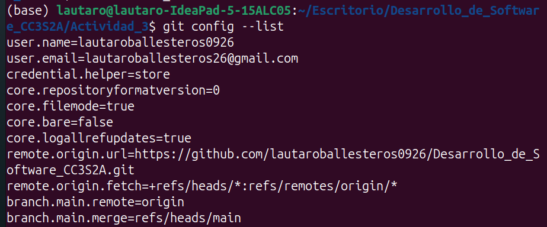

## Git init: Donde comienza tu viaje de codigo 

Debido a que ya tenemos el directorio .git/ creado, crearemos una subcarpeta donde realizaremos toda la Actividad 3. Procedemos a ello 

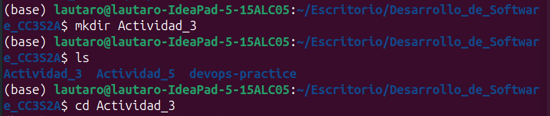

## Git add: Preparando tu codigo 

Creamos un archivo README.md a traves del comando `echo "README" > README.md` y realizamos el comando `git status`

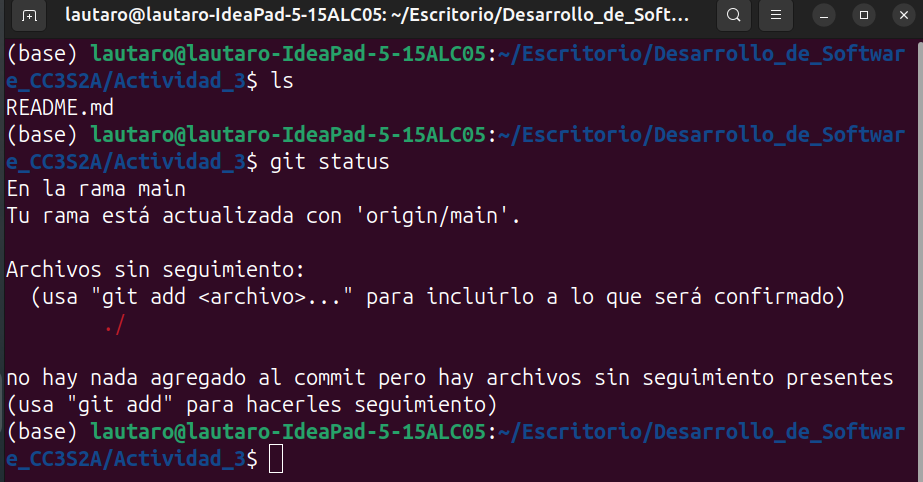

Como se observa en la imagen git detecta archivos no rastreados, es por eso nos alerta y nos dice agregarlo con git add. 

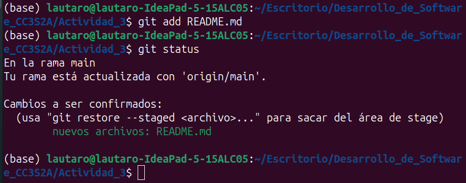

Agregamos el archivo al area de staged. Estamos listo para ya hacer nuestro primer commit 

## Git commit: regitra cambios 

Una vez pasamos nuestro archivo al area de staged estamos listo para hacer un commit. Utilizamos el comando `git commit -m "Mi primer commit"`. 

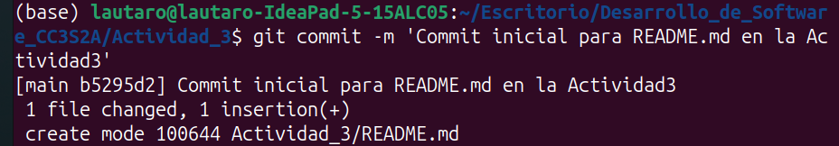

Utilicemos el comando `git status`

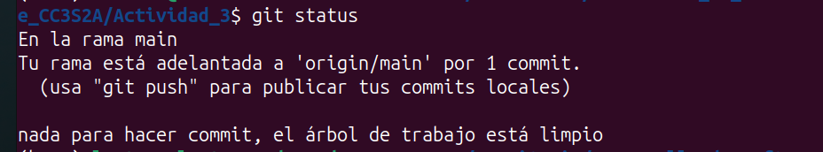

Arbol de trabajo limpio, no hay nada de que preocuparnos. 

## Git log: Recorrer el arbol de commits 
Ahora veremos nuesto historial de cambios con el comando `git log`. Salida: 

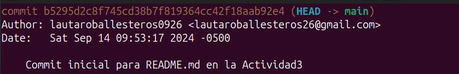  

### Revisaremos alguna de las opciones que tenemos para `git log`

- git log -oneline: Muestra una salida resumida, bastante util para revisar el historial de manera rapida. 

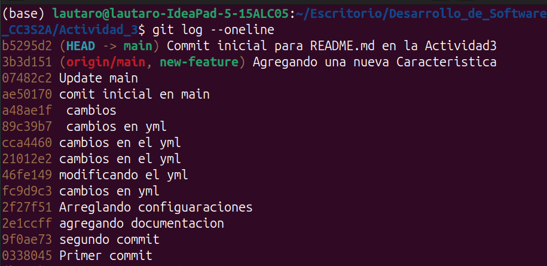

- git log --graph: Visaulizamos el historial de branches (ramas), en un diseño grafico. Obs: Como este repositorio tiene muchas actividad es normal que tenga commits con anterioridad. 

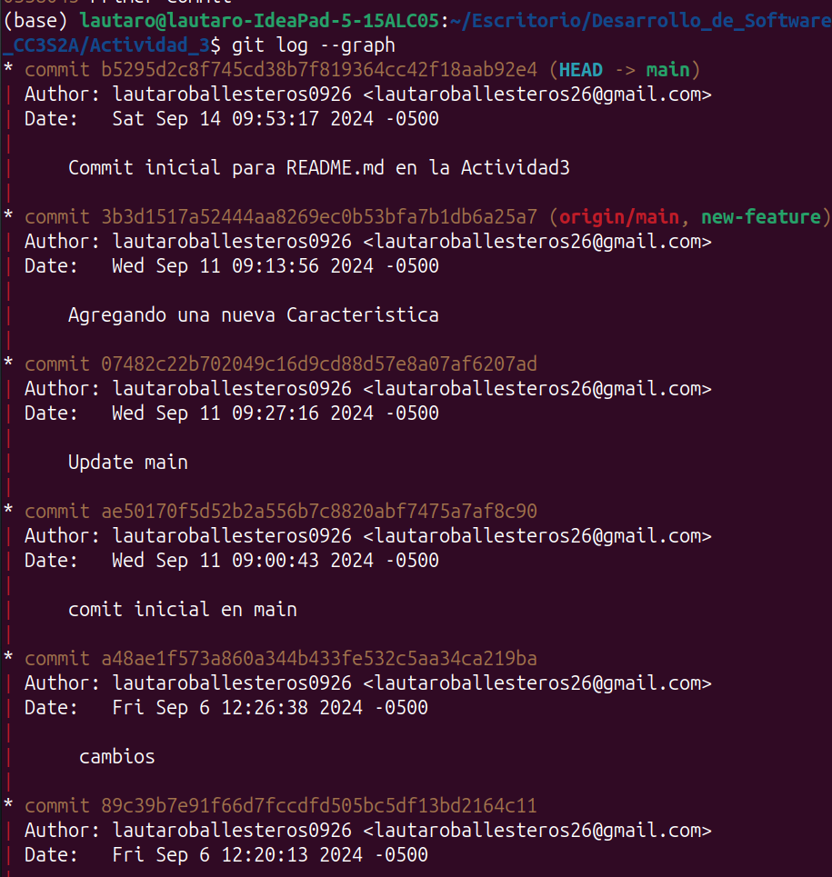

- git log --author='<author>' : Revisar los commit hechoss por un determinado autor especifico 

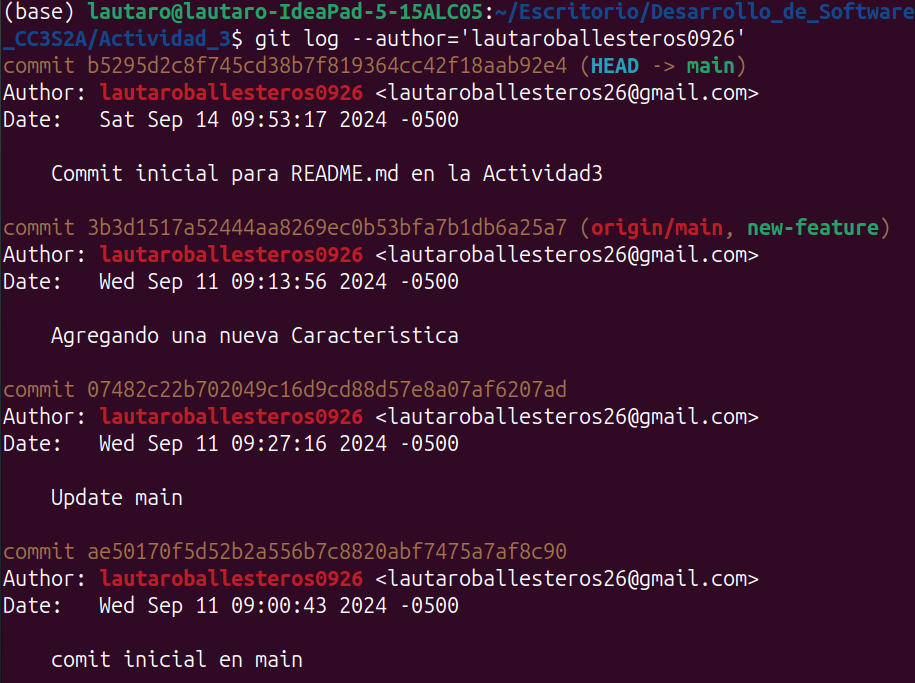

### Pregunta: ¿ Cual es la salida de este comando?  

La pregunta es la siguiente: `git log --graph --pretty=format:'%x09 %h %ar ("%an") %s'`.

Su respectiva salida : 

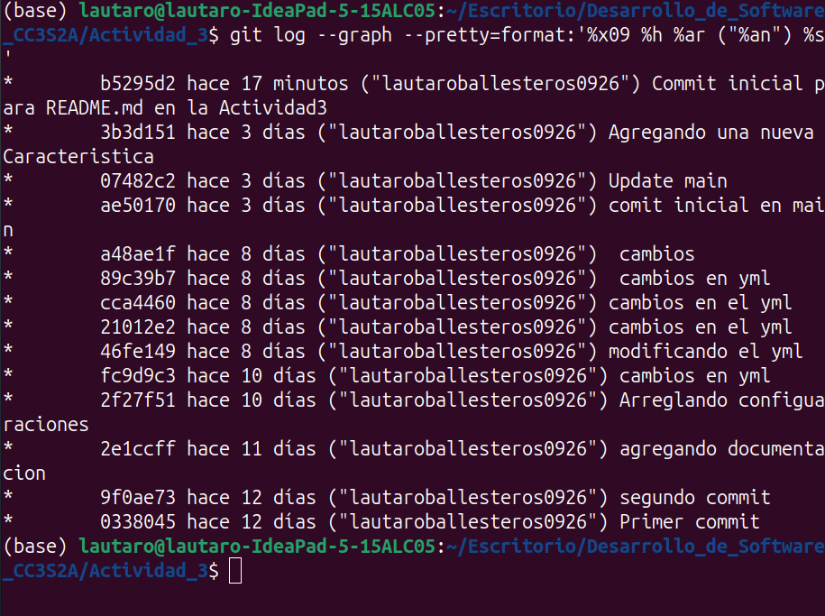

La pregunta que es lo que busca este comando, procemos a explicarlo: 

- `--graph`: Muestra un gráfico de ramas en el historial de commits, con líneas que representan la estructura de las ramas y fusiones.
- `--pretty=format`: Personaliza el formato de salida con las siguientes opciones:
    - `%x09`: Inserta una tabulación (espacio).
    - `%h`: Muestra el hash corto del commit (la primera parte del hash completo).
    - `%ar`: Muestra el tiempo transcurrido desde que se hizo el commit (por ejemplo, "2 hours ago", "3 weeks ago").
    - `("%an")`: Muestra el nombre del autor del commit entre comillas.
    - `%s`: Muestra el mensaje del commit (el mensaje de confirmación).
### Intentemos el comando git log en este ejercicio (puedes realizar otra cosa como colocar las cosas en español). Primero, actualiza el archivo README.md y crea un nuevo archivo CONTRIBUTING.md:

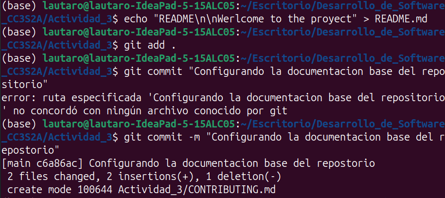

Agregando un archivo en python: 

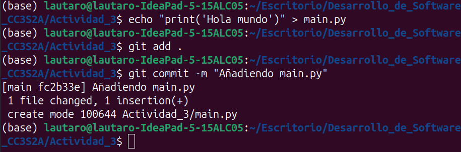

Utilizanod `git log oneline`: 

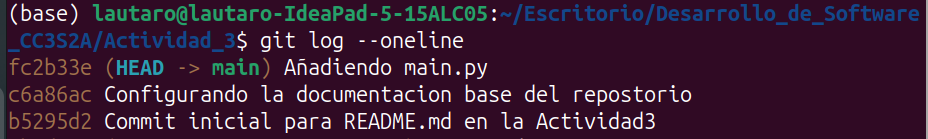

## Trabajar con branches: La piedra angular de la colaboracion 

Veamos las ramas que tenemos: 

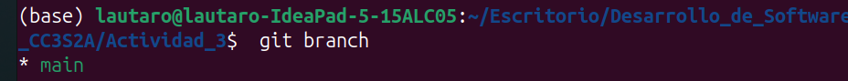

Crearemos una nueva rama llamada 'feature/new-feature' :

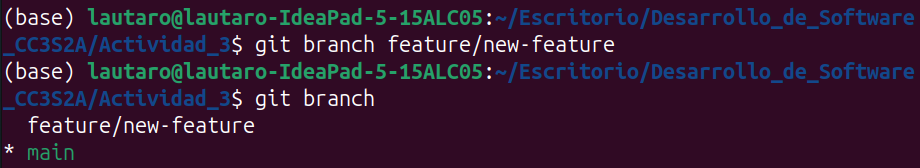

Las convenciones de nombres de branches son importantes para la comunicación. Un estándar
comúnmente utilizado es anteponer el nombre de la branch con feature/, bugfix/ o hotfix/, seguido
de una breve descripción. Esto facilita que cualquiera entienda el propósito de la branch de un
vistazo. 

Importante tambien mencionar que para crear ramas desde otra rama que tengamos tenemos estos comandos: 
 - `git branch <new-branch-name> <base-branch-name>`
 - ` git branch <new-branch-name> <commit-hash>`
Este ultimo nos ofrece crear una rama desde un commit en especifico a traves de su hash. 

## git checkout/git switch: Cambiar entre branches 

Procedemos a cambiar de rama (branch) a la branch que creamos en la anterior seccion. Utilizamos en comando `git checkout feature/new-feature`: 

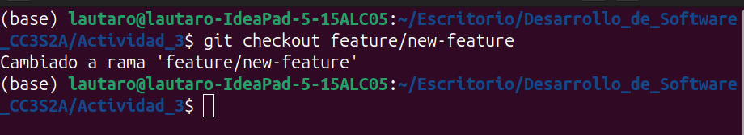

Este grafico nos ayuda a visualizar donde nos econtramos: 

Algunos detalles importantes: 

Para crear una nueva branch y cambiar a ella en un solo paso, podemos utilizar lo siguiente: 

 - `git checkout -b feature/another-new-feature`

Creamos la rama 'feature/another-new-feature' y nos cambiamos a esta rama. En equivalencian, tenemos: 
 - `git branch feature/another-new-feature`
 - `git checkout feature/another-new-feature`

## git merge: Fusionando branches 

Para este punto crearemos un commit adicional en nuestra rama 'feature/ new-feature' 

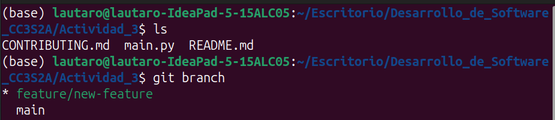

Modifiquemos el Readme y crearemos un nuevo commit: 

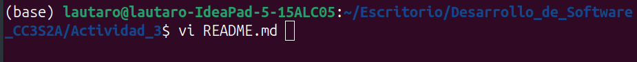
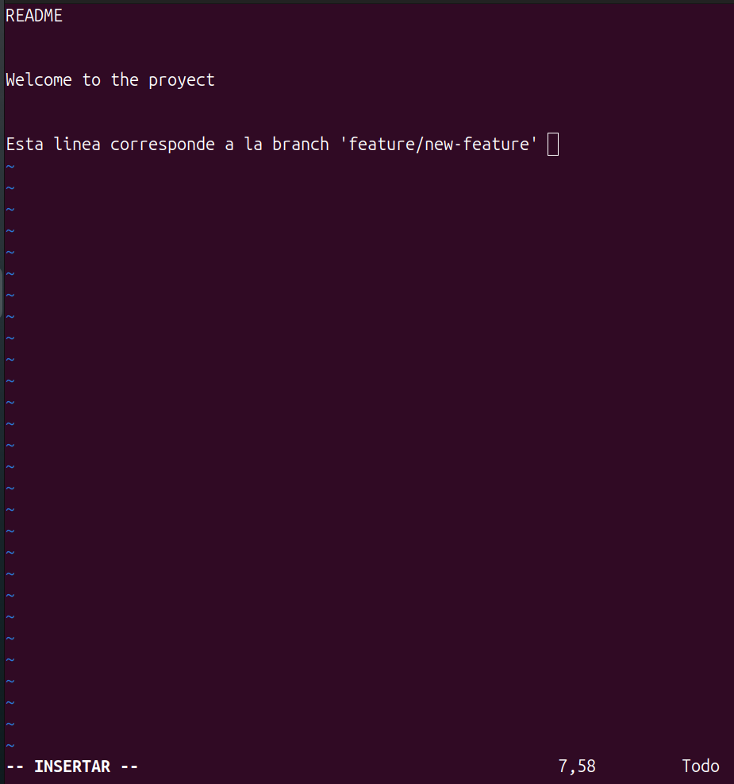

Agreagamos los cambios, y realizamos un commit (recordar que estamos en la rama  'feature/new-feature'). 

Cambiamos a la rama main, y desde ahi realizamos el merge con el comando `git merge feature/new-feature`

Para ver como quedan nuestras ramas despues de fusionarlas utilizamos el comando `git log --graph`, vizualizamos: 

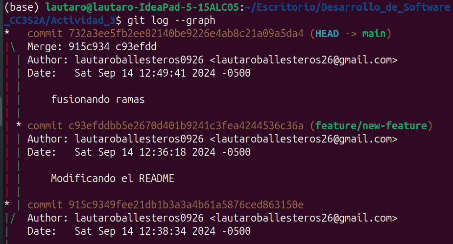

## git branch -d: Eliminando una branch 

Para mantener limpio nuestro repositorio procedemos a eliminar esta rama con `git branch -d feature/new-feature`: 

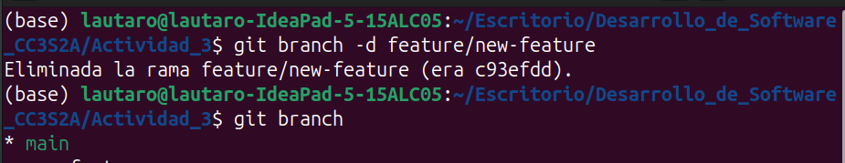

Preguntas:
 - ¿Cómo te ha ayudado Git a mantener un historial claro y organizado de tus cambios?
    Es claro que el control de versiones que ofrece Git es bastante completo, podemos saber quien hizo los cambios,cuando los hizo y donde los hizo. Regresar en el tiempo es su superpoder de Git (volver a commits anteriores), crear nuevas ramas en donde creemos nuevas feature,etc. Es una herramienta diria indispensable que todo desarrollador deberia saber utilizar.  
 - ¿Qué beneficios ves en el uso de branches para desarrollar nuevas características o corregir
errores?
    El hecho mismo de no afectar nuestra rama principal nos permite experimentar, sin afectar nuestro trabajo ya hecho en la rama principal es uno de los beneficios más importantes. 
 - Realiza una revisión final del historial de commits para asegurarte de que todos los cambios
   Relizado. 
se han registrado correctamente.
 -  Revisa el uso de branches y merges para ver cómo Git maneja múltiples líneas de desarrollo.
    En secciones anteriores a traves del comando `git log --graph` observamos el uso de branches y merges dentro de git.

